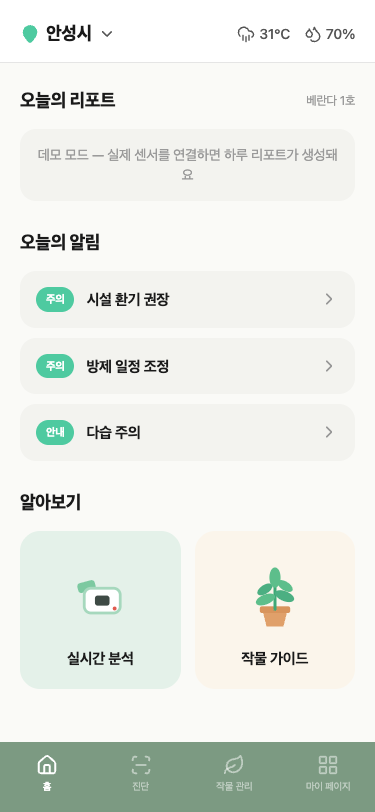
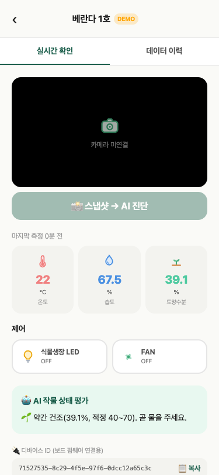
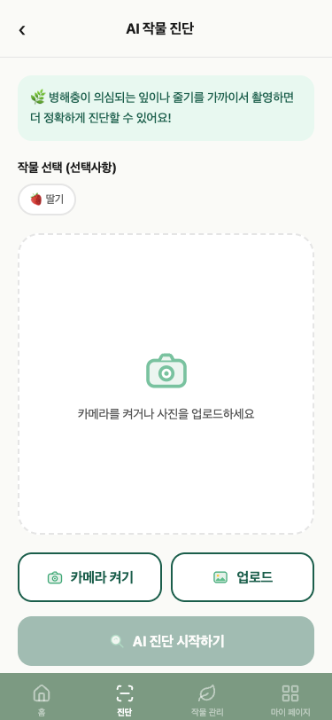
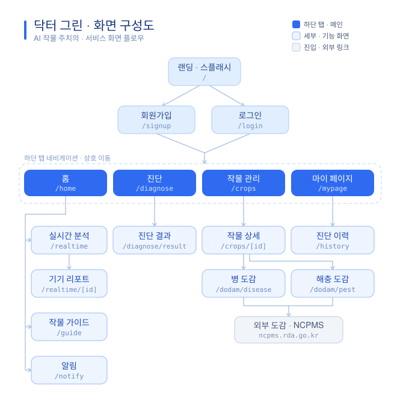

# 🌱 Doctor Green (닥터 그린)

> ESP32 센서와 AI 병해 진단으로 우리 집 작물을 돌봐주는 스마트팜 반려식물 관리 앱

<p align="center">
  
  
  
</p>

---

## 소개

**Doctor Green**은 ESP32 기반 센서 모듈이 수집한 온도·습도·토양수분 데이터를 실시간으로 보여주고,
LED/팬을 원격으로 제어하며, 스마트폰 카메라로 찍은 작물 사진을 AI로 분석해 병충해를 진단해주는
Next.js 기반 웹 애플리케이션입니다. 기상청·농촌진흥청 공공데이터를 함께 연동해 재배 환경 판단에
필요한 정보를 한곳에 모았습니다.

## 주요 기능

- **실시간 센서 모니터링** — 온도·습도·토양수분 값을 실시간으로 확인하고(`app/realtime/[deviceId]`),
  날짜별 24시간 추이 그래프로 과거 데이터를 되짚어볼 수 있습니다(`app/history`).
- **LED / 팬 원격 제어** — 앱에서 켜고 끄면 Supabase의 원하는 상태(desired state)가 갱신되고,
  ESP32가 이를 폴링해 실제 GPIO를 제어합니다.
- **AI 병해충 진단** — 작물 사진을 업로드하면 Hugging Face Space의 YOLO 모델이 병해충을 탐지하고,
  종합 건강 평가와 함께 결과를 보여줍니다(`app/diagnose`).
- **오늘의 리포트** — 자정 이후 쌓인 센서 데이터를 서버(RPC)에서 집계해 하루 요약을 홈 화면에 보여줍니다.
- **작물 가이드 / 병해충 도감** — 작물별 재배 가이드와 병해·해충 도감을 제공해 초보자도 쉽게
  이상 증상을 찾아볼 수 있습니다(`app/guide`, `app/dodam`).

## 아키텍처

```
┌──────────┐   HTTP POST(센서값)   ┌────────────┐        폴링(desired state)   ┌──────────┐
│  ESP32   │ ────────────────────▶ │  Supabase   │ ◀──────────────────────────  │  ESP32   │
│ (센서)   │                       │ (DB/Auth)   │ ─────────────────────────▶  │ (LED/팬) │
└──────────┘                       └─────┬──────┘        GPIO 제어              └──────────┘
                                          │
                                          │ REST / RPC
                                          ▼
                                 ┌──────────────────┐
                                 │  Next.js App      │
                                 │  (App Router)      │
                                 └───┬───────┬───────┘
                                     │       │
                     이미지 업로드    │       │  공공데이터 프록시(API Route)
                                     ▼       ▼
                     ┌────────────────────┐ ┌───────────────────────────────┐
                     │ Hugging Face Space  │ │ 기상청(KMA) · 농진청(NCPMS)   │
                     │  YOLO 병해충 진단   │ │ · 팜맵(FarmMap)               │
                     └────────────────────┘ └───────────────────────────────┘
```

- **센서 경로**: ESP32가 Wi-Fi로 Supabase에 센서값을 직접 POST합니다(Blynk 등 중계 서버를 거치지 않음).
- **원격 제어**: 앱에서 LED/팬 버튼을 누르면 `devices.led_on` / `devices.fan_on` 컬럼(원하는 상태)만
  갱신되고, ESP32가 주기적으로 이 값을 읽어와 실제 하드웨어를 맞춥니다.
- **AI 진단**: 앱 서버(API Route)가 이미지를 Base64로 받아 Gradio Client로 Hugging Face Space를
  호출하고, YOLO 추론 결과를 그대로 프론트에 반환합니다. 실패 시 가짜 데이터로 대체하지 않고
  에러를 그대로 전달합니다.
- **공공데이터 연동**: 기상청(KMA) 단기예보, 농촌진흥청 병해충 정보시스템(NCPMS), 팜맵(FarmMap)
  API를 서버 사이드 Route Handler에서 프록시해 클라이언트에 안전하게 전달합니다.

## 기술 스택

| 영역 | 사용 기술 |
|---|---|
| 프레임워크 | Next.js 16 (App Router), React 19, TypeScript |
| 스타일 | Tailwind CSS 4 |
| 데이터베이스 / 인증 | Supabase (Postgres, Auth, RPC) |
| 차트 | Recharts |
| AI 진단 연동 | Hugging Face Space (YOLO), `@gradio/client` |
| 공공데이터 | 기상청(KMA), 농촌진흥청(NCPMS), 팜맵(FarmMap) |
| 하드웨어 | ESP32 (센서 수집 + GPIO 제어) |

## 로컬 실행 방법

```bash
npm install
cp .env.example .env.local   # 아래 표를 참고해 값 채우기
npm run dev
```

브라우저에서 [http://localhost:3000](http://localhost:3000) 접속.

### 환경 변수 (`.env.example`)

| 변수 | 설명 |
|---|---|
| `KMA_KEY` | 기상청 공공데이터포털 단기예보 API 인증키 |
| `NCPMS_KEY` | 농촌진흥청 국가농작물병해충관리시스템(NCPMS) API 인증키 |
| `FARMMAP_KEY` | 팜맵(농경지 경계) API 인증키 |
| `HF_SPACE_ID` | AI 병해충 진단용 Hugging Face Space ID (예: `username/space-name`) |
| `NEXT_PUBLIC_SUPABASE_URL` | Supabase 프로젝트 URL |
| `NEXT_PUBLIC_SUPABASE_ANON_KEY` | Supabase 익명(anon) 공개 키 |

## 시스템 플로우 다이어그램

<p align="center">
  
</p>

라이트/다크 모드에 따라 자동으로 배색이 바뀌는 SVG입니다(`portfolio/` 폴더에 영문 버전과 PNG 버전도 있습니다).

## 참고

교육 목적의 파생 저장소로 **doctor-green-edu**(가상 실습실 포함, 2시간 수업용)가 별도로 존재합니다.
이 저장소는 실제 서비스용 코드만 유지합니다.
