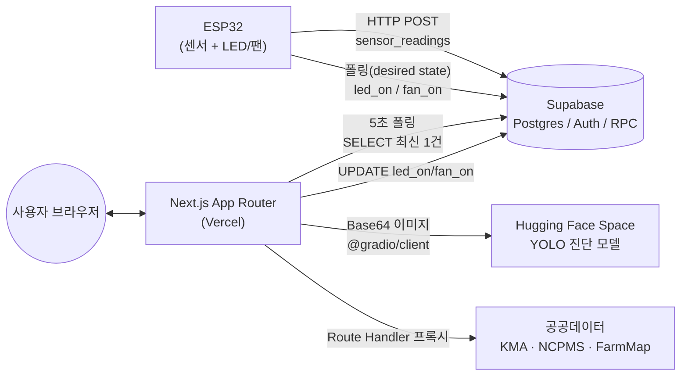

# 아키텍처 문서 (Architecture)

이 문서는 Doctor Green의 주요 설계 결정과 그 이유, 그리고 의도적으로 선택한 트레이드오프를 정리합니다.
"왜 이렇게 만들었나"에 대한 답을 코드가 아니라 문서로도 남기기 위한 목적입니다.

## 목차

1. [시스템 개요 (System Overview)](#1-시스템-개요-system-overview)
2. [센서 경로: ESP32 → Supabase 직접 연결](#2-센서-경로-esp32--supabase-직접-연결)
3. ["실시간"의 실제 구현: 5초 폴링과 트레이드오프](#3-실시간의-실제-구현-5초-폴링과-트레이드오프)
4. [액추에이터 제어: Desired-State 패턴](#4-액추에이터-제어-desired-state-패턴)
5. [AI 진단 파이프라인](#5-ai-진단-파이프라인)
6. [공공데이터 프록시 계층](#6-공공데이터-프록시-계층)
7. [알려진 한계와 향후 계획 (Known Limitations)](#7-알려진-한계와-향후-계획-known-limitations)

---

## 1. 시스템 개요 (System Overview)



- **ESP32**: 센서값을 Wi-Fi로 Supabase에 직접 POST, LED/팬 상태는 Supabase를 폴링해서 반영.
- **Next.js App**: 사용자 화면, 센서 값 표시, 액추에이터 제어 요청, AI 진단 요청, 공공데이터 프록시를 모두 담당.
- **Supabase**: 센서 원시 데이터(`sensor_readings`), 디바이스 desired-state(`devices.led_on/fan_on`), 인증(Auth), 집계용 RPC를 제공.
- **Hugging Face Space**: YOLO 기반 병해충 탐지 모델을 별도 서비스로 분리 운영.

---

## 2. 센서 경로: ESP32 → Supabase 직접 연결

ESP32는 중계 서버(예: Blynk, 자체 백엔드) 없이 Wi-Fi로 Supabase의 `sensor_readings` 테이블에 온도·습도·토양수분 값을 직접 POST합니다. README에도 "Blynk 등 중계 서버를 거치지 않음"이라고 명시되어 있습니다.

**왜 이렇게 했나**
- 별도의 브로커/백엔드 서버를 운영·배포·모니터링할 필요가 없어 인프라가 단순해집니다.
- Supabase의 REST API(PostgREST)가 이미 인증·Row Level Security를 제공하므로, ESP32는 HTTP POST 한 줄로 끝납니다.
- 앱 서버(Next.js)는 센서 데이터 수신 경로에 관여하지 않고, 오직 조회(SELECT)만 담당합니다 — 앱 서버 장애가 센서 데이터 수집을 막지 않습니다.

**트레이드오프**
- ESP32가 Supabase 키(anon key 또는 이에 준하는 인증정보)를 펌웨어에 들고 있어야 하므로, 디바이스 단위의 세밀한 권한 분리(RLS 정책)가 중요해집니다.
- 중계 서버가 없다는 것은 재전송 큐잉, 배치 처리, 스키마 검증 같은 로직도 없다는 뜻입니다. 네트워크가 불안정한 환경에서는 유실된 측정값이 그대로 유실됩니다.

---

## 3. "실시간"의 실제 구현: 5초 폴링과 트레이드오프

앱 화면(`app/realtime/[deviceId]`)이 보여주는 "실시간 모니터링"은 실제로는 **Supabase Realtime 구독이 아니라 5초 간격 폴링**입니다.

```ts
// app/realtime/[deviceId]/useDeviceLive.ts
const POLL_INTERVAL = 5000;
...
interval = setInterval(doPoll, POLL_INTERVAL);
```

`doPoll`은 매번 `lib/sensors.ts`의 `readSensors(deviceId)`를 호출해 `sensor_readings`에서 최신 1건과 `devices.led_on/fan_on`을 함께 조회합니다. 소켓 연결이나 채널 구독(`supabase.channel(...)`, `postgres_changes`)은 이 저장소 어디에도 없습니다.

### 왜 Realtime 구독이 아니라 폴링을 선택했나

- **단순성**: `setInterval` + 일반 `SELECT` 한 번으로 끝나서, 연결 상태 관리·구독 해제·에러 복구 로직이 필요 없습니다. 코드량과 실패 지점이 적습니다.
- **연결 수명 관리 불필요**: Realtime 구독은 WebSocket 연결을 유지해야 하고, 브라우저 탭 백그라운드 전환, 네트워크 전환(Wi-Fi ↔ 셀룰러), 재접속 등 연결 수명 관리가 필요합니다. 폴링은 매 요청이 독립적이라 이런 상태를 신경 쓸 필요가 없습니다.
- **UX 요구 수준에 5초면 충분**: 온도·습도·토양수분은 초 단위로 급변하는 값이 아니고, ESP32 자체도 센서를 매 초 단위로 갱신하지는 않습니다. 사용자가 "실시간"으로 체감하는 데 5초 지연은 문제가 되지 않는 도메인입니다.

### Realtime 구독으로 전환한다면 고려해야 할 것

- **연결 수명 관리**: 탭이 백그라운드로 가거나 기기가 잠들 때 구독을 끊고 포그라운드 복귀 시 재구독하는 로직이 필요합니다(그렇지 않으면 좀비 연결이 쌓입니다).
- **재연결 전략**: 네트워크 순단 시 자동 재연결과 그 사이 유실된 이벤트를 보정하기 위한 재조회(reconciliation) 로직이 필요합니다. 폴링은 이 문제가 애초에 없습니다(다음 폴링이 곧 최신 상태 재조회이므로).
- **비용**: Supabase Realtime은 동시 접속 연결 수 기준으로 과금·제한됩니다. 디바이스 수, 동시 접속 사용자 수가 늘어나면 폴링 대비 비용 구조가 달라집니다. 반면 폴링은 요청 수가 늘어나는 대신 상태 유지 비용이 없습니다.
- **다중 클라이언트 정합성**: 같은 디바이스를 여러 탭/기기에서 보고 있을 때 Realtime은 이벤트 기반으로 즉시 동기화되지만, 폴링은 각 클라이언트가 독립적으로 최대 5초까지 어긋날 수 있습니다.

결론적으로, 현재 사용 규모(가정용 소수 디바이스, 개인 대시보드)에서는 폴링이 구현 복잡도 대비 이득이 명확했고, Realtime 전환은 동시 사용자/디바이스 수가 늘어나 "5초 지연이 UX상 문제가 되는" 시점에 재검토할 사안으로 판단했습니다.

---

## 4. 액추에이터 제어: Desired-State 패턴

LED/팬 제어는 앱이 하드웨어에 직접 명령을 보내는 구조가 아니라, **앱은 "원하는 상태"만 DB에 기록하고 ESP32가 그 상태를 폴링해서 따라가는** desired-state 패턴입니다.

```ts
// lib/sensors.ts:143-153
export async function writeActuator(deviceId: string, pin: "led" | "fan", value: boolean) {
  const col = pin === "led" ? "led_on" : "fan_on";
  const { data, error } = await supabase
    .from("devices")
    .update({ [col]: value })
    .eq("id", deviceId)
    .select("led_on, fan_on")
    .single();
  if (error) return { error: error.message };
  return { error: null, ledOn: data.led_on ?? false, fanOn: data.fan_on ?? false };
}
```

앱은 `devices.led_on` / `devices.fan_on` 컬럼만 갱신할 뿐, ESP32에 직접 신호를 보내지 않습니다. ESP32가 이 컬럼을 자체 주기로 폴링해 실제 GPIO를 맞춥니다. 이 구조 덕분에 ESP32가 일시적으로 오프라인이어도 "원하는 상태"는 DB에 안전하게 남아있고, 재연결되는 순간 자동으로 반영됩니다.

### 낙관적 업데이트로 하드웨어 지연 흡수

문제는 앱의 센서 폴링(5초 주기)과 ESP32의 GPIO 반영 폴링 주기가 서로 다르고 즉시 동기화되지 않는다는 점입니다. 사용자가 토글을 누른 직후 다음 센서 폴링이 돌면, ESP32가 아직 새 상태를 반영하기 전이라 이전 값이 화면에 다시 나타나며 "눌렀는데 안 눌린 것처럼" 깜빡이는 문제가 생길 수 있습니다.

이를 막기 위해 `useDeviceLive.ts`는 토글 직후의 서버 응답값을 `pendingRef`에 담아, **다음 2번의 폴링 주기 동안은 폴링으로 받아온 값 대신 이 값을 우선 사용**합니다.

```ts
// app/realtime/[deviceId]/useDeviceLive.ts:34-45
const pending = pendingRef.current;
const merged = { ...r };
if (pending.led) {
  merged.ledOn = pending.led.value;
  pending.led.cycles -= 1;
  if (pending.led.cycles <= 0) pending.led = null;
}
if (pending.fan) {
  merged.fanOn = pending.fan.value;
  pending.fan.cycles -= 1;
  if (pending.fan.cycles <= 0) pending.fan = null;
}
```

즉 "토글 직후 서버가 돌려준 값이 진실"이라는 가정을 2 사이클(약 10초) 동안 유지하다가, 이후에는 다시 폴링 값을 신뢰하는 방식으로 앱 상태와 실제 하드웨어 반영 사이의 시간차를 흡수합니다.

---

## 5. AI 진단 파이프라인

작물 사진 진단은 앱 서버가 이미지를 직접 추론하지 않고, `@gradio/client`로 별도 운영되는 Hugging Face Space(YOLO 모델)를 호출하는 구조입니다(`app/api/diagnose/route.ts`).

### 연결 재사용과 재시도

- **모듈 레벨 `clientPromise` 캐싱**: 요청마다 Gradio 클라이언트를 새로 연결하지 않도록, 최초 연결을 모듈 스코프 변수에 캐싱해 이후 요청에서 재사용합니다. 연결 실패 시에는 캐시를 비워 다음 요청이 재시도할 수 있게 합니다.
- **502/타임아웃 1회 재시도**: 첫 호출이 실패하면 캐시된 연결이 죽었을 가능성을 감안해 `clientPromise`를 초기화하고 재연결 후 한 번 더 시도합니다.
- **`maxDuration = 60`**: Hugging Face Space는 유휴 상태에서 콜드 스타트가 걸릴 수 있어, Route Handler의 최대 실행 시간을 60초로 늘려 첫 호출의 지연을 흡수합니다.

### 클라이언트 워밍업

`app/diagnose/page.tsx`는 사용자가 진단 화면에 진입하면 `/api/diagnose/ping`을 **3초 간격, 최대 10회** 폴링해 HF Space를 미리 깨웁니다(`PING_INTERVAL_MS = 3000`, `PING_MAX_ATTEMPTS = 10`). ping 라우트 자체는 5초 타임아웃으로 Space의 `/config` 엔드포인트를 두드리기만 하고, 응답 성공 여부와 무관하게 "깨우는 신호는 보냈다"는 것으로 충분하다고 보고 타임아웃도 실패로 취급하지 않습니다.

### 실패 시 폴백 없음 (명시적 원칙)

```ts
// app/api/diagnose/route.ts:87
// ⚠️ 폴백/가짜데이터 없음 - 실패는 실패로 반환
```

진단 호출이 최종적으로 실패하면 가짜 진단 결과로 대체하지 않고 502와 에러 메시지를 그대로 클라이언트에 반환합니다. 병해충 진단은 사용자의 실제 대처(방제, 격리 등)로 이어질 수 있는 정보이므로, 불확실한 상황에서 그럴듯한 값을 지어내는 것보다 "모른다"고 말하는 편이 낫다고 판단했습니다.

---

## 6. 공공데이터 프록시 계층

기상청(KMA), 농촌진흥청 병해충 정보시스템(NCPMS), 팜맵(FarmMap), 지오코딩 등 외부 공공데이터 API는 클라이언트가 직접 호출하지 않고 Next.js Route Handler가 서버 사이드에서 프록시합니다. 이렇게 하면 API 키가 클라이언트 번들에 노출되지 않습니다.

이 라우트들은 공통 유틸 `lib/upstream.ts`의 `fetchUpstream`을 공유합니다.

```ts
// lib/upstream.ts
export async function fetchUpstream(
  url: string,
  options: FetchUpstreamOptions = {}
): Promise<Response> {
  const { timeoutMs = 8000, retries = 1, ...init } = options;
  const controller = new AbortController();
  const timer = setTimeout(() => controller.abort(), timeoutMs);
  try {
    const res = await fetch(url, { ...init, signal: controller.signal });
    if (!res.ok) throw new UpstreamError(`Upstream fetch failed: ${res.status}`, res.status);
    return res;
  } catch (e) {
    if (retries > 0) return fetchUpstream(url, { ...options, retries: retries - 1 });
    ...
  } finally {
    clearTimeout(timer);
  }
}
```

- **`AbortController` 8초 타임아웃**: 공공데이터 API는 응답 지연이 잦아, 무한 대기 대신 8초에서 끊고 실패로 처리합니다.
- **1회 재시도**: 일시적인 네트워크 오류나 5xx 응답에 대해 자동으로 한 번 더 시도합니다(멱등한 GET 요청을 전제로 함).
- **`UpstreamError`**: 원본 상태 코드를 보존한 커스텀 에러로, 상위 Route Handler가 클라이언트에 적절한 상태 코드를 전달할 수 있게 합니다.

이 유틸을 `app/api/kma`, `app/api/ncpms`, `app/api/ncpms/search`, `app/api/farmmap`, `app/api/geocode` 라우트가 공통으로 사용해, 외부 API 호출 관련 에러 처리 로직을 한 곳에 모았습니다.

---

## 7. 알려진 한계와 향후 계획 (Known Limitations)

정직하게 남겨두는 현재 한계와, 이를 개선하기 위한 방향입니다.

### 회원가입 실패 시 고아(orphan) 계정 가능성

`lib/auth.ts`의 `signUp`은 (1) Supabase Auth에 계정을 생성하고, (2) `profiles` 테이블에 부가 정보를 insert하는 2단계로 이루어져 있습니다.

```ts
// lib/auth.ts:24-49
const { data, error } = await supabase.auth.signUp({ email, password });
...
const { error: profileError } = await supabase.from("profiles").insert({ ... });
if (profileError) {
  return { error: "프로필 저장 실패: " + ... };
}
```

두 단계가 하나의 트랜잭션으로 묶여있지 않아서, 1단계(Auth 계정 생성)는 성공했는데 2단계(profiles insert)가 실패하면 `profiles` 레코드 없이 Auth 계정만 존재하는 고아 계정이 생길 수 있습니다. 이 경우 사용자는 "프로필 저장 실패" 메시지를 받지만 이미 Auth 계정은 만들어진 상태라 재가입 시도 시 "이미 가입된 이메일"로 막힐 수 있습니다.
**향후 계획**: Auth 계정 생성 시 트리거로 `profiles` 행을 자동 생성하거나(Postgres trigger on `auth.users`), 실패 시 보상 트랜잭션(Auth 계정 롤백)을 추가하는 방향을 검토 중입니다.

### Supabase 스키마가 마이그레이션만으로 완전히 재현되지 않음

이 저장소의 `supabase/migrations/`에는 `daily_report` RPC 하나(`20260707120048_daily_report_rpc.sql`)만 존재합니다. 그러나 코드가 참조하는 `sensor_readings`, `devices`, `profiles` 테이블과 `sensor_history_range` RPC의 스키마 정의는 마이그레이션 파일로 존재하지 않습니다 — 즉, 이 저장소만으로는 처음부터 동일한 DB를 재현할 수 없고, 실제 운영 Supabase 프로젝트의 스키마가 소스 오브 트루스입니다.
`lib/report.ts`에도 이 문제로 인한 방어 코드가 남아있습니다: `daily_report` RPC가 배포 DB에 아직 적용되지 않았거나 에러가 나면 클라이언트 사이드 집계(`.limit(2000)`, 측정 주기가 매우 짧으면 하루치를 다 못 볼 수 있음)로 폴백합니다.
**향후 계획**: 전체 스키마(테이블 정의, RLS 정책, 기존 RPC 포함)를 마이그레이션으로 소급 작성해 `supabase db reset`만으로 동일한 환경을 재현할 수 있게 만드는 작업이 필요합니다.

### 사용자 피드백이 `alert()` 기반

폼 검증 실패, 저장/제어 실패 등 에러 피드백이 대부분 브라우저 네이티브 `alert()`로 처리되어 있습니다(`app/crops/page.tsx`, `app/crops/[id]/page.tsx`, `app/diagnose/page.tsx`, `app/realtime/page.tsx`, `app/realtime/[deviceId]/useDeviceLive.ts`, `app/realtime/[deviceId]/page.tsx`, `app/diagnose/result/page.tsx` 등). 빠르게 기능을 검증하기에는 충분했지만, 모바일 웹뷰나 반복 사용 시 UX가 매끄럽지 않고 스타일링도 불가능합니다.
**향후 계획**: 토스트/스낵바 컴포넌트로 교체해 앱 디자인 톤에 맞추고, 접근성(스크린리더 알림)도 함께 개선할 예정입니다.
