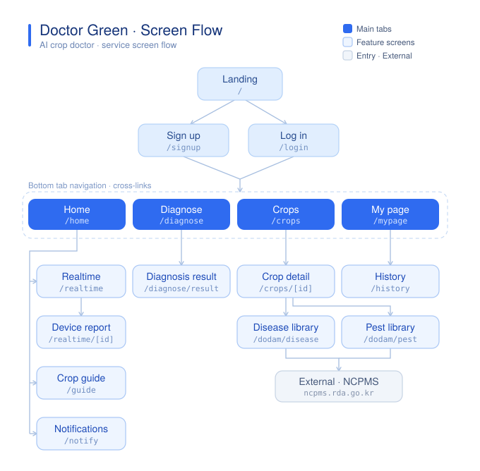

# 닥터 그린 — 화면 구성도 플로우 (포트폴리오 자산)

블루·화이트 톤 서비스 화면 흐름도. 한국어(ko) / 영어(en), 라이트 / 다크 / 자동 전환 제공.

## 파일

| 파일 | 설명 |
|---|---|
| `doctor-green-flow-{ko,en}-light.png` | 라이트 모드 · **투명 배경** · 2040×2004 (3x) — 밝은 배경 위에 |
| `doctor-green-flow-{ko,en}-dark.png` | 다크 모드 · **투명 배경** · 2040×2004 (3x) — 어두운 배경 위에 |
| `doctor-green-flow-{ko,en}-auto.svg` | **한 파일이 OS 테마 따라 라이트↔다크 자동 전환** (`prefers-color-scheme`) |
| `doctor-green-flow-{ko,en}-{light,dark}.svg` | 편집용 정적 벡터 소스 |

## 자동 전환 SVG 사용법

``로 넣기만 하면 됩니다. 브라우저가 OS(또는 상위 페이지)의 라이트/다크 설정을 SVG 내부 `@media (prefers-color-scheme)`에 그대로 전달합니다.

```html

```

- Chrome / Firefox / Safari 최신 버전에서 동작 확인.
- 배경은 투명이므로 라이트 페이지엔 밝게, 다크 페이지엔 어둡게 자연스럽게 얹힙니다.

## 참고

- PNG는 래스터라 자동 전환이 안 됩니다 → 밝은/어두운 배경별로 각각의 PNG를 쓰세요.
- 색을 바꾸려면 `*-light.svg` / `*-dark.svg`의 `<style>` 팔레트만 수정 후 `rsvg-convert -z 3` 로 재변환.
